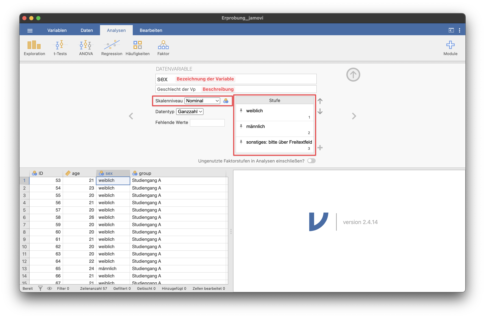
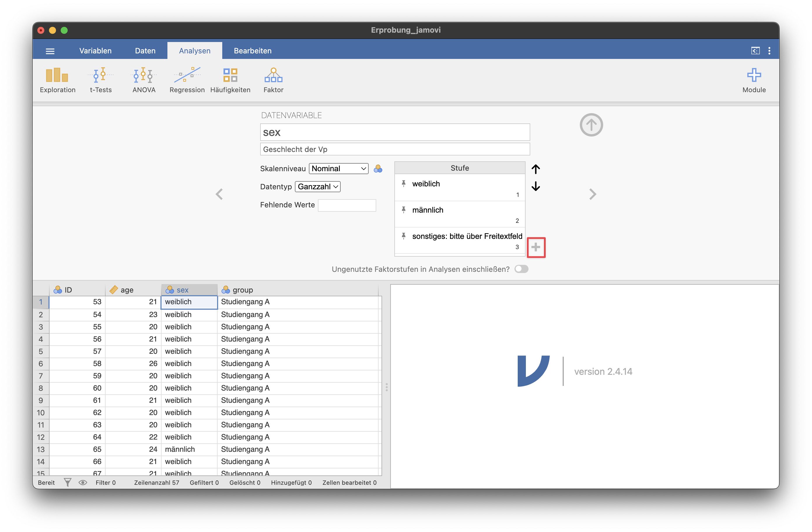
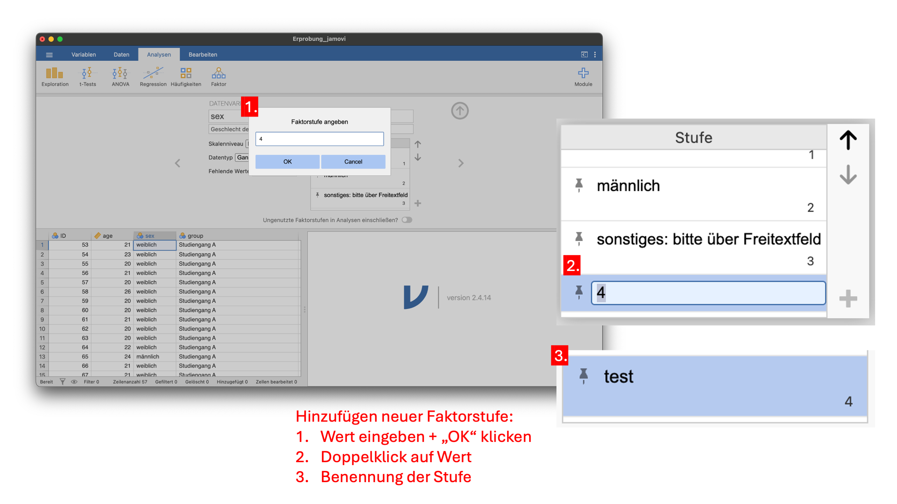

# testingjamovi
Test-Repo für das Projekt Jamovi
Auf dieser Seite findet sich ein Leitfaden für die Arbeit mit Jamovi zum statistischen Auswerten von Datensätzen.

# Arbeit in der Programmoberfläche
## Datensatz einlesen

Dateien, die lokal auf dem Rechner gespeichert sind, können über das Menü an der linken Seite geöffnet werden. Dazu muss man lediglich zur gewünschten Datei navigieren und diese auswählen.
Die Übungsdatensätze können durch Klick auf "Datenbibliothek" aufgerufen werden.

>[!Note]
>### Unterschied .xlsx und .sav
>Bei .sav-Dateien werden die Bezeichnungen/Beschreibungen der Faktorstufen und das Skalenniveau übernommen, während man das Skalenniveau bei .xlsx händisch einstellen muss.

## Datensatz aufbereiten
>[!Tip]
>Die folgenden Aktionen können entweder im Tab "Variablen" oder in den Menüpunkten "Daten" oder "Analysen" durchgeführt werden. Die Funktionsweise unterscheidet sich nicht.

Über einen Doppelklick auf den Variablennamen öffnet sich eine Ansicht, in der die Variable bearbeitet werden kann. Hier können Name, Beschreibung, Skalenniveau und Faktorstufen eingestellt und verändert werden.

Bei den Skalenniveaus "Nominal" und "Ordinal" werden die in den Daten vorkommenden Faktorstufen automatisch in die Liste der Faktorstufen eingefügt. Weitere Faktorstufen können händisch hinzugefügt werden.
Hierzu muss man das Plus-Icon anklicken, im sich öffnenden Feld den Zahlenwert der neuen Faktorstufe eintragen und auf "OK" klicken. Anschließend kann man die Faktorstufe per Doppelklick auf den neuen Eintrag benennen.

>[!Tip]
>Setzt man den Haken bei "Ungenutzte Faktorstufen in Analyse einschließen", werden in Auswertungen auch Faktorstufen, die nicht gewählt wurden, mit einbezogen. (Beispielsweise, wenn auf einer Likert-Skala der Wert 3 kein einziges Mal als Antwort ausgewählt wurde)
